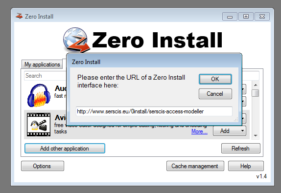

.. _install:

Installation
============

Linux
-----
To install, use `0install <http://0install.net>`_. For example, on Ubuntu::

  $ sudo apt-get install zeroinstall-injector

To get SAM (creating a command called "sam")::

  $ 0alias sam http://www.serscis.eu/0install/serscis-access-modeller 

Mac OS X
--------

Get the 0install bundle from http://0install.net/install-mac.html (version 1.11 or later).

To get SAM (creating a command called "sam") enter this command in terminal::

  $ 0alias sam http://www.serscis.eu/0install/serscis-access-modeller

Windows
-------
1. Get 0install from `0install.de <http://0install.de/downloads/?lang=en>`_.
2. Get Java from `<http://java.com>`_.
3. Run Zero Install, `Add other application` and paste in the URI `<http://www.serscis.eu/0install/serscis-access-modeller>`_.
4. Click the `Run` button to start it.
  

   Using the graphical installer on Windows.

The remaining dependencies (IRIS, SWT, GraphViz) will be downloaded automatically (Java is not downloaded
automatically due to unclear licensing terms).

You can also install a "sam" command, as on Linux::

  C:\> 0alias sam http://www.serscis.eu/0install/serscis-access-modeller 

Running
-------

To run SAM from the command-line::

  $ sam

You can then use the `File` menu to load one of the example files.

To run in batch mode (without opening a window)::

  $ sam --batch scenario.sam

See the :ref:`tutorial` for instructions on writing the scenario.sam file.
