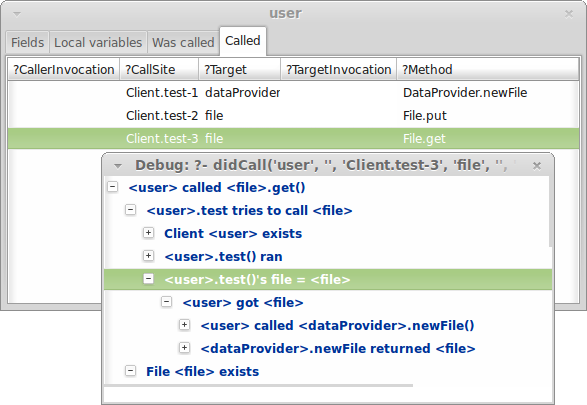

.. highlight:: java

.. _Tutorial:

SAM tutorial
============

A model contains several sections:

* A model of the behaviour of the objects in the system. This behaviour corresponds to the design or source code.

* The scenario being modelled, which consists of:

  * The objects initially present and their connections.
  * The test cases to be tried.

* Goals (security properties to be verified).
* Aggregation rules to control the level of detail modelled.

All of these can be placed in a single file, or spread across several files.

Example scenario
----------------
Our running example will be a data hosting service. Users can upload files and
share them with other users and services. We want to look at the effects of
using different access control mechanisms and policies.

The steps are as follows (these are typical when making a SAM model):

1. Create a simple model of the system including only trusted actors.
2. Record the access possible in the model as a baseline.
3. Introduce other, untrusted actors.
4. Investigate the warnings generated by the tool and update the design to fix any issues.

Behaviour
---------
We'll start by modelling the data hosting provider as a factory, similar to the one described in the :ref:`Concepts` page.

A `DataProvider` object creates new objects of type "File", corresponding to the following Java
code::

  class DataProvider {
    public Object newFile() {
      Object file = new File();
      return file;
    }
  }

.. note::
  SAM uses a small Java-like syntax to define behaviour. The above Java code can be
  used as-is, but more complex code must be simplified.

The `File` type has `get` and `put` methods for reading and writing data. In SAM, we only need to model behaviour that affects
access control. We need to provide these methods because we want to check who can call them, but because they only take and return
data (e.g. `byte[]`), not references, they don't propagate access rights and so they are equivalent to methods that take no arguments,
do nothing, and return nothing, and that is how we model them::

  class File {
    public void get() {}
    public void put() {}
  }

Finally, our `Client` will test the provider by creating a new `File` and using it::

  class Client {
    private Object myDataProvider;

    public Client(Object dataProvider) {
      myDataProvider = dataProvider;
    }

    public void test() {
      Object file = myDataProvider.newFile();
      file.put();
      file.get();
    }
  }

.. note::
  In this simplified language, all methods must be public and all fields must be private. Types should generally be declared
  as `Object` or `Ref` for user-defined classes.

See :ref:`Behaviour` for more information about defining behaviour. See :ref:`Types` for more information about SAM's
type system.

Configuration
-------------
We can now define the initial configuration::

  config {
      Ref user;
      Ref dataProvider;
  
      test {
          dataProvider = new DataProvider();
  
          user = new Client(dataProvider);
          user.test();
      }
  }

See :ref:`Configuration` for more information.

Running the scenario
--------------------
Putting these together gives a complete model file (:example:`data1`). You can run the model like this:

.. code-block:: sh

  $ sam data1.sam

See :ref:`install` for more information about running SAM.

SAM will open a window displaying the results:

   The SAM GUI.

This shows that, given the behaviour and initial configuration:

* `user` calls `dataProvider`
* `dataProvider` creates `file`
* `user` gets access to `file` and calls it

The dashed arrows indicate references only held in local variables, while solid arrows
indicate references held in fields (`myDataProvider` in this case).

See :ref:`Graphing` for more information about the graphs produced.

What the model means
--------------------
To understand what the model means, it is necessary to understand how objects and events in the
model correspond to objects and events in the real system.

* Events that *did* happen in the model represent events that *might* happen in the real system.
* Events that *did not* happen in the model represent events that *cannot* happen in the real system.
* One object in the model may represent many potential objects in the real system. For example, the
  single `file` object in the model represents all the `File` objects that may be created in the real system.

In particular, the behaviour defined for `Client.test` does not mean that the real system will create
exactly one file, call `put` on it once and then call `get` once. Instead, it means that this method
may call `myDataProvider.newFile` any number of times, and may call `get` and `put` on any of the resulting
objects any number of times and in any order.

The green dashed arrow from `user` to `file` means that the client `might` invoke some of the files that
it creates (or it might not). The lack of a green arrow from `file` to `dataProvider` means that no `File`
in the real system will ever call any method on the real `DataProvider` object.

Therefore, two kinds of property are possible:

* *Safety properties*, which assert that something can never happen in the real system.
* *Liveness possibilities*, which assert that something isn't prevented by the model.

Because our model is an over-approximation of the real system, safety properties provide
a much stronger guarantee than liveness properties. Liveness properties are mainly useful
as a sanity check that the model isn't too restrictive.

Using the GUI
-------------
By default, SAM opens a window to display the results. You can use this interface to explore the model interactively.

.. note::
 You can also run SAM in batch mode (using `--batch`), in which case it checks the model but does not open a window.

You will see four menus along the top:

* `File` allows you to switch to a different model, reload the current one, save the results, or quit.
* `Objects` allows you to explore the model from the point of view of each object individually.
* `Relations` shows the internal Datalog relations.
* `Help` provides access to the documentation.

For example, if you select `Objects -> user` then you will see results relevant to the `user` object:

* Fields: The object's `myDataProvider` holds a reference to `dataProvider` (in the real system: it can never hold any other value).
* Local variables: e.g. the constructor's `dataProvider` variable holds a reference to the `dataProvider` object.
* Was called: It was called only by `_TestDriver` (a special object that implements the `config` setup code).
* Called: It invoked `dataProvider.newFile`, `file.get` and `file.put` (in the real system: it can never make any calls except these).

You can double-click on any line in these tables to find out **why** the line is there. For example, if you double-click on the call to `file.get`
in the `Called` tab, you will see the reason given as:

   Using the SAM debugger.

Each item shows something that was true in the model. The children of each item show the reasons why it was true. Reasons that are typically important
are shown in bold. Less important reasons are displayed faded.

So, this tells us that <user>'s `test()` method called <file>.get() because it got back <file> when it called <dataProvider>'s `newFile` method.

Note that there may be many ways that something could be true. The SAM debugger displays one example showing how it could happen.

Saving a baseline
-----------------

Our model so far only includes trusted actors with defined behaviour. The calls that happen in this model correspond to the calls that should be allowed
to happen in the real system.

Use `File -> Export calls` to save all the calls that happened to a new file (:example:`includes/data1MustCall`). If you look in this file, you will see three sections:

* a set of :func:`mustCall` facts that list every call that happened in the model.
* a pair of :func:`mayCall` rules that allow the special test driver object to call anything without triggering errors.
* a set of :func:`checkCalls` facts telling SAM that for the three existing objects, it should check not only that all calls may happen, but that no other calls happen either.

.. note::
	SAM uses ref:`Datalog` syntax to state facts and rules. Literal strings must be in double-quotes.
	Variable names are preceded by "?".

Now import this file by adding this line to your model file::

  import "data1MustCall.sam".

When you change the model, you can just press F5 to reload and reevaluate it. You shouldn't see any difference now, since the set of calls hasn't changed.

Adding other clients
--------------------

Our model only considers a single client, which isn't very realistic. We could regard `user` as an aggregation of all possible users of the system, but
this doesn't allow us to prove some useful properties. For example, the arrow from `user` to `file` would just mean that, in the real system, some users
could access some files. We need to separate out the users if we want to check whether one user can access another user's files, for example.

Luckily, it suffices to use just two model objects for this: one representing some particular user and another aggregating all other users of the system. We then
show that none of the other users can access that user's files. Since we could have chosen any user as the particular user being modelled, this result holds
for all users.

We also need to tell SAM that objects created by these other users should not be aggregated into `file`, but into a separate object. This is easily done by
creating a new `test` block labelled with a "context" ("Others")::

  config {
      Ref user;
      Ref otherUsers;
      Ref dataProvider;
  
      test {
          dataProvider = new DataProvider();
  
          user = new Client(dataProvider);
          user.test();
      }
  
      test "Others" {
          otherUsers = new Client(dataProvider);
          otherUsers.test();
      }
  }

If you run this model (:example:`data2`), SAM will show a new `otherUsers` object (representing all the other users) and a new `fileOthers` object
(representing all the files they may create).

.. sam-output:: data2

It will also show a red arrow from `otherUsers` to `dataProvider`, indicating that an object from the baseline got called when it didn't before.
You can double-click on the warning message to see the reason:

* <otherUsers> called <dataProvider>.newFile() [Others]
* !mayCall('otherUsers', 'dataProvider', 'DataProvider.newFile').

We don't really care who else uses the `dataProvider`; we only care about who uses our `file` object, so we can remove the `checkCalls("dataProvider")` line.
After reloading, the model is now "OK", and the lack of an arrow from `otherUsers` to `file` means that none of the other users will ever invoke a method
on our sample user's files.

Modelling unknown behaviour
---------------------------

The results we got above assumed that `otherUsers` behaves as we defined for a `Client`. That is, they only try to create files and then use the files
they create. The next step is to change their type to `Unknown`. `Unknown` is a built-in type which attempts to make every invocation that is possible,
so any safety property that is valid with `Unknown` behaviour will be valid for any other behaviour too. Change the constructor call like this::

    test "Others" {
        otherUsers = new Unknown(dataProvider);
        otherUsers.test();
    }

In the display, the `otherUsers` object is now shown in blue to indicate `Unknown` behaviour, but the model is otherwise unchanged (the arrow from `otherUsers` to `fileOthers` becomes solid because `otherUsers` may now store the file reference in a field, but nothing else changes). This shows that `otherUsers`
still cannot get access to `user`'s `file`.

.. sam-output:: data3

Modelling non-capability systems
--------------------------------

By default, SAM models object-capability systems. In such systems, the only way to get access to an object is to create the object or be given a reference
to it from someone who has it. Modelling such systems usually shows that they have good security properties. However, most current systems use a different
design: instead of bundling authorisation with designation they separate these two aspects out, so that it is possible to know the address of an actor and
try to invoke it even when you don't have permission. Security is provided in these systems by access control policies.

To indicate that an object is publicly available (anyone could get a reference to it), use the :func:`isPublic` tag. A border around the object indicates that it
is public. To model a typical web-based distributed system we simply mark all objects as public ("something is public if it is an object")::

  isPublic(?X) :- isRef(?X).

Since we have no access control, this immediately and unsurprisingly leads to the discovery of some problems:

* `otherUsers` may invoke methods on `user` (or perhaps on the user's computer)
* `otherUsers` may invoke methods on `file` (the user's files).

.. sam-output:: data4

Orange arrows indicate calls that were involved in the problem. In this case, `otherUsers` was only able to call `file` because `user` used `dataProvider`
to create `file` first.

.. note::
  Why does <user> call <fileOthers>? The answer is that `otherUsers` calls `user.test()` in the context "Other". The files that `user` creates
  in this context are aggregated into `fileOthers`. So we can't use this model to show that `otherUsers` never gets access to any of `user`'s files; only
  that it doesn't get access to those that `user` creates on its own initiative.
  We would need to tell SAM to aggregate new objects created by `user` in the context "Other" into a third group
  if we wanted to show that. However, since this is just an effect of the incorrect call from `otherUsers` to `user`, we will not consider it further.

Modelling role-based access control
-----------------------------------

To fix this, we must enable access control, give each actor an identity, and define some policies. Each initial object is given an identity
using :func:`hasIdentity`::

  accessControlOn.
  
  hasIdentity(<user>, "user.crt").
  hasIdentity(<otherUsers>, "otherUsers.crt").
  hasIdentity(<dataProvider>, "provider.crt").

You can use any unique string for the identity. Here, we use the convention of adding .crt ("certificate") to the object name. In the real system,
having an identity might mean knowing the private key that corresponds to the public key in your X.509 certificate, for example.
When an object creates a new object, the new object gets the same identity as its parent (e.g. the `File` objects created by `dataProvider`
will be on the same machine as `dataProvider` itself, so they also get the `provider.crt` identity).

We will model a system with role-based access control. In such a system there is a mapping that assigns roles to actors based on
their identities, and a policy saying which roles allow access to which methods. We can use the :func:`PermittedRole` annotation to
say which role is required to call each method::

  class DataProvider {
    @PermittedRole("world")
    public File newFile() {
      Object file = new File();
      return file;
    }
  }

  grantsRole(<dataProvider>, "world", ?Identity) :- hasIdentity(?AnyObject, ?Identity).

The :func:`grantsRole` rule says that "dataProvider" grants the "world" role to any identity the exists (anyone can create a new file).

We could update `File` in a similar way, granting `user` and `otherUsers` a "user" role. However, that wouldn't work because
`otherUsers` would still be able to access `user`'s files. Instead, we will create a system where the user passes their identity
(e.g. X.509 certificate) when creating a new `File`. The new `File` will store this and will grant the "owner" role to callers
with this identity::

  class File {
    private String myOwner;

    public File(String owner) {
      myOwner = owner;
    }

    @PermittedRole("owner")
    public void get() {}

    @PermittedRole("owner")
    public void put() {}
  }

  // A file grants the "owner" role to Identity if Identity is a value of the "myOwner" field:
  grantsRole(?File, "owner", ?Identity) :- field(?File, "myOwner", ?Identity).

We must update `DataProvider` to pass through the `owner` argument, and update `Client` to provide its identity (:example:`data5`).
SAM now reports that the model is safe:

.. sam-output:: data5

Showing roles in the GUI
------------------------

You can tell SAM to add extra tabs to the object viewer window. This code (:example:`includes/rbacTabs`) adds tabs showing which roles
this object has on all other objects, and which roles it grants to others::

  declare hasRole(Ref object, Ref target, String role).
  hasRole(?Object, ?Target, ?Role) :-
      hasIdentity(?Object, ?Identity),
      grantsRole(?Target, ?Role, ?Identity).

  guiObjectTab(50, "Has roles", "hasRole/3", "object").
  guiObjectTab(60, "Grants roles", "grantsRole/3", "target").

   Adding custom tabs to the GUI.

See :func:`guiObjectTab` for more details.

Adding a service
----------------

Now we want to add a visualisation service to the system. A user gives the service (read) access to a file and the service creates a rendered
graph of the data in the file::

  class ServiceProvider {
      public Ref process(Ref file) {
          Ref image = new File();
          file.get();
          image.put();
          return image;
      }
  }
  
  class Client {
    private Ref myDataProvider;
    private Ref myServiceProvider;
  
    public Client(Ref dataProvider, Ref serviceProvider) {
      myDataProvider = dataProvider;
      myServiceProvider = serviceProvider;
    }
  
    public void test() {
      Ref file = myDataProvider.newFile();
      file.put();
      Ref result = myServiceProvider.process(file);
      result.get();
    }
  }
  
  config {
      Ref user;
      Ref dataProvider;
      Ref serviceProvider;
  
      test {
          dataProvider = new DataProvider();
          serviceProvider = new ServiceProvider();
  
          user = new Client(dataProvider, serviceProvider);
          user.test();
      }
  }

Modelling this with a single client, using capabilities and no access control (:example:`service1`) creates a new baseline:

.. sam-output:: service1

Adding back in the `otherUsers` object shows that this design is still safe when using object-capabilities (:example:`service2`):

.. sam-output:: service2

.. note::

  Unknown objects aggregate all child objects they may create themselves. So `otherUsers` may represent
  further data provider services and files (also with `Unknown` behaviour), in addition to the
  objects we defined explicitly. The arrow from `serviceProvider` to `otherUsers` indicates
  `serviceProvider` reading from these files.

Adding a service in a non-capabilities system
---------------------------------------------

Turning on access control and the RBAC policy shows that required access is missing (:example:`service3`):

.. sam-output:: service3

The user needs some way to grant `serviceProvider` read access to the data (`file`), and `serviceProvider` needs to grant `user` access
to the resulting image. We can add an extra method to `File` for this::

  class File {
    private String myOwner;
    private String myReader;

    public File(String owner) {
      myOwner = owner;
    }

    @PermittedRole("owner")
    @PermittedRole("reader")
    public void get() {}

    @PermittedRole("owner")
    public void put() {}

    @PermittedRole("owner")
    public void grantReadAccess(String id) {
      myReader = id;
    }
  }

  grantsRole(?File, "owner", ?Identity) :- field(?File, "myOwner", ?Identity).
  grantsRole(?File, "reader", ?Identity) :- field(?File, "myReader", ?Identity).

This is the same pattern that we used for the "owner" role. After updating `Client` to grant access on `file` and `serviceProvider` to grant
access on `image`, all required access is possible again (:example:`service4`):

.. sam-output:: service4

However, adding `otherUsers` back in shows that this design is not safe (:example:`service5`):

.. sam-output:: service5

`serviceProvider` may read `file` and `image` in response to calls from `otherUsers`. For example, double-clicking on the `file` problem shows the
reason as:

* <serviceProvider> called <file>.get() [Others]
    * <serviceProvider>.process may call <file>
        * <serviceProvider>.process()'s file = <file>
            * <serviceProvider> received <file> (arg to ServiceProvider.process)
                * <otherUsers> called <serviceProvider>.process() [Others]
    * Access control: <serviceProvider> may call <file>.get
        * <file>.myReader = <serviceProvider.crt>
            * <file> received <serviceProvider.crt> (arg to File.grantReadAccess)
                * <user> called <file>.grantReadAccess()

So, `serviceProvider` tried to process `file` because `otherUsers` asked it to, and it was able to because `user` granted `serviceProvider` read access.

Fixing this problem requires more changes to the design. When `serviceProvider`
reads a file, it needs to first check that its caller would be able to read
it. We'll add an extra method `checkCanRead`, which takes an identity as an argument and returns `true` if that identity has a role that allows
calling `File.get` (:example:`service6`)::

  class File {
    ...
    @PermittedRole("owner")
    @PermittedRole("reader")
    public boolean checkCanRead(String id) {
      boolean verified = true :- grantsRole(this, ?Role, id), PermittedRole("File.get", ?Role);
      return verified;
    }
  }

This demonstrates how Datalog can be embedded into the Java syntax to make the language more expressive where necessary. Care must be taken when
doing this that the implementer of the real system will be able to turn this into real code (for example, it is easy to rely on a private field in
another object using this syntax, but the real software would not be able to do that). In this case, we assume that the code will able to query
its own access control policy, even though we don't model the access control system itself.

We can then update the service provider to check that its caller has read access on the file::

  class ServiceProvider {
      @PermittedRole("world")
      public Ref process(Ref uncheckedFile) {
          Ref image = new File("serviceProvider.crt");

          String caller = ?Identity :- hasIdentity($Caller, ?Identity);
          boolean checkResult = uncheckedFile.checkCanRead(caller);

          Ref file = uncheckedFile :- mayReturn(uncheckedFile, $Context, "File.checkCanRead", true);
          file.get();
          image.grantReadAccess(caller);
          image.put();
          return image;
      }
  }

Here we say that the Java variable `caller` may be set to `Identity` if the caller of this method has that identity. Again, we assume some API
that lets the programmer of the real system discover the identity of the caller. See :ref:`Behaviour` for a full description of the Datalog syntax.

Finally, we assign `file = uncheckedFile` only if `uncheckedFile.checkCanRead` could return `true`.

.. sam-output:: service6

.. note::

  Why do we need to do the :func:`mayReturn` test, rather than just `file = uncheckedFile :- checkResult = true`?

  The reason is that we are aggregating two kinds of calls into the `Other` case:

  * in some, a genuine file is passed and `checkResult = false`.
  * in others, a fake file is passed and `checkResult = true`.

  Therefore, in the aggregated model, `checkResult` could be `true` and `uncheckedFile` could be <file>, which doesn't allow us to verify the property (it is an over-aggregation). The `mayReturn` makes a stronger check: we only use a particular `uncheckedFile` if that object returned `true`, not if any possible other value of `uncheckedFile` could return `true`.

Unknown providers
-----------------

The model shows that other people can't access the sample user's files, provided that the user only uses providers with the defined behaviour. Of course,
if the user uploads data to a malicious hosting provider then we must assume that that data is compromised. However, it is still useful to ask whether this
could affect the integrity of data at the good providers.

We could create a new `otherProviders` object with `Unknown` behaviour and have `user` call that, but we can achieve the same thing by reusing `otherUsers`
(two `Unknown` objects with the ability to communicate with each other won't do anything that a single `Unknown` object wouldn't).

Here, we have renamed `otherUsers` to `others` and changed the API of `Client` to allow testing with different providers (:example:`service7`) ::

  class Client {
    public void test(Ref dataProvider, Ref serviceProvider) {
      Ref file = dataProvider.newFile("user.crt");
      file.put();
      String serviceIdentity = ?Cert :- hasIdentity(serviceProvider, ?Cert);
      file.grantReadAccess(serviceIdentity);
      Ref result = serviceProvider.process(file);
      result.get();
    }
  }

  config {
      Ref user;
      Unknown others;
      Ref dataProvider;
      Ref serviceProvider;

      test {
          dataProvider = new DataProvider();
          serviceProvider = new ServiceProvider();

          user = new Client();
          user.test(dataProvider, serviceProvider);
      }

      test "Others" {
          others = new Unknown(dataProvider, serviceProvider);
          others.test();
          user.test(others, others);
      }
  }

.. sam-output:: service7

This reveals a number of new problems:

* `user` may be tricked into accessing `file` (representing files it created in the base case) from the `Others` case, because the `Unknown` service provider's `process` method may return the address of the existing `file` instead of creating a new one.

* `others` may be able to read from `file` because `file.myReader = <others.crt>`, which happened because `user` granted access. This happened because `user` tried to create a new file using the `Unknown` provider and it returned the address of the existing `file` object instead. Thinking it was a new file, `user` then granted the unknown provider read access on it.

* `serviceProvider` may read `file` if `others` ask it to process it. Our `checkCanRead` method returned true to say that `others` had access (due to the previous problem).

* `user` may be tricked into accessing `image` because the `Unknown` service provider may return the address of the existing `image` instead of generating a new output file.

At this point, we could add yet more access control checks to the design, or we could decide to try the scenario using capability-based access control (:example:`service8`):

.. sam-output:: service8

This shows that, when using object-capabilities, `user` may safely use services and data hosting provided by parties with unknown behaviour, without the possibility of exposing access to
data held at their trusted sites.

Conclusions
-----------

We have modelled a simple system with a data provider and some users. We have shown the using an object-capabilities
model the system implements our desired security properties (e.g. that a user's files can't be accessed by other users). We also modelled an identity-based
access control system and showed that it is able to provide the same security properties, although with more complexity.

We then extended our scenario with a service (data-processing) provider. Using object capabilities the required security properties were proven again,
while the identity-based system required further updates to support delegation to allow this use case to work. Adding untrusted users back into the
model revealed that the access policies contained a subtle flaw and that the real system would need to perform additional checks to prevent this.

Finally, we extended the model again to consider a user using both trusted and untrusted services. SAM detected a number of additional vulnerabilities
in the design using identity-based access control. The capability-based design continued to maintain the required security properties while requiring
considerably less code.
